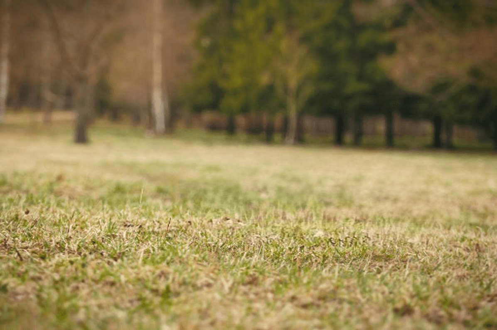
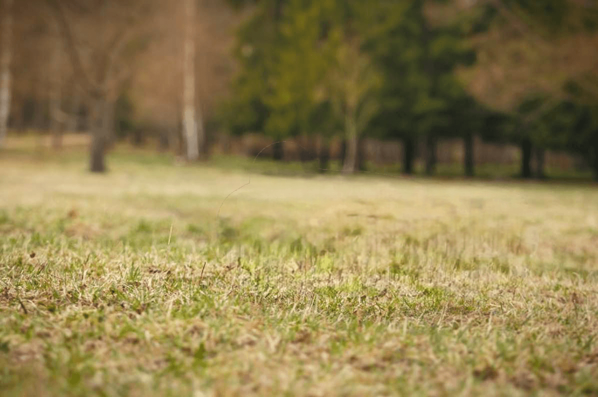

# Remove Anything

[](https://huggingface.co/aaronb/remove_anything )
[](https://pypi.org/project/remove-anything/)
<!-- [](https://huggingface.co/aaronb/remove_anything ) -->


A python package that includes some SOTA inpainting models that does not require text. 

- **Easy to use**: simple and unified API.
- **Self contained**: each method is self contained in a file or directory, easy for copy-and-use.


| Original                  | Mask                 |                      |                     |
| ------------------------- | -------------------- | -------------------- | ------------------- |
|  |  |                      |                     |
| MAT                       | FCT                  | LaMa                 | LDM                 |
|  |  |  |  |

## Install

```bash
pip install remove_anything
pip install git+https://github.com/Zeqiang-Lai/Remove-Anything.git
```

## Usage

- Gradio 

```bash
python -m remove_anything.app --ckpt checkpoints/big-lama.pt --device cuda
python -m remove_anything.app --model lama --device cuda
```

- Python API 

```python
from remove_anything import LaMa
model = LaMa(ckpt_path='big-lama.pt', device='cuda')
# image: (numpy array) [H,W,3] datarange=(0,1)
# mask: (numpy array) [H,W,1] datarange=(0,1)
output = model(image, mask)
```

> The checkpoints would be automatically downloaded if using gradio app. 
> 
> For API usage, you could download checkpoint at [Huggingface](https://huggingface.co/aaronb/remove_anything).

## Supported Models

- [LaMa](https://github.com/saic-mdal/lama) :  efficient for high resolution image.
- [LDM](https://github.com/CompVis/latent-diffusion) : powerful diffusion model, relative slow, better for fixed size image (512 x 512).
- [MAT](https://github.com/fenglinglwb/MAT) :  better for fixed size image (512 x 512).
- [FCF](https://github.com/SHI-Labs/FcF-Inpainting): Only support fixed size image (512 x 512).


## Acknowledgement

[lama-cleaner](https://github.com/Sanster/lama-cleaner)